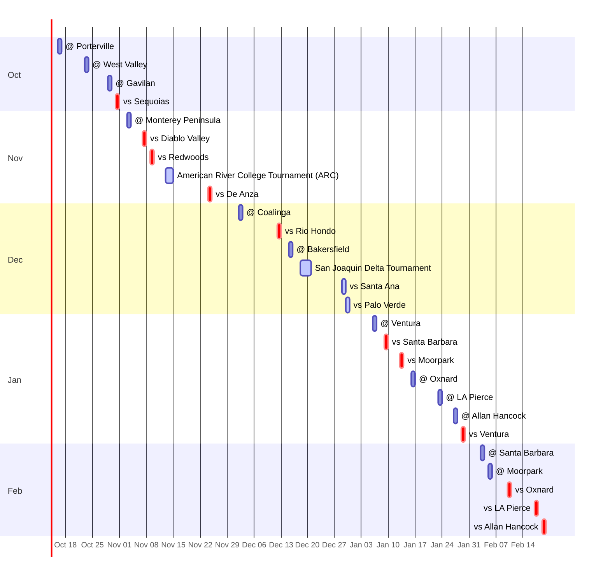

# 🏀 Cuesta College Men's Basketball — 2026-27

**[📅 Calendar view](https://johnlinwiz.github.io/cuesta-mbb/)** · **[➕ Subscribe (.ics)](https://johnlinwiz.github.io/cuesta-mbb/cuesta-mbb.ics)** · **[🗓️ Month grids](CALENDAR.md)** · **[🗺️ Venue map](venues.geojson)** · **[🔔 Reminders](https://github.com/johnlinwiz/cuesta-mbb/issues)**

> **Next up (in 8 days):** Fri Oct 16 · 2:00 PM · @ Porterville · (scrimmage) — [Porterville College Gym](https://www.google.com/maps/search/?api=1&query=Porterville+College+Gym%2C+100+E+College+Ave%2C+Porterville%2C+CA+93257), Porterville, CA  
> 🚗 Pasadena [3h 06m](https://www.google.com/maps/dir/?api=1&origin=Pasadena%2C+CA&destination=100+E+College+Ave%2C+Porterville%2C+CA+93257&travelmode=driving) · 160 mi · SLO [3h 16m](https://www.google.com/maps/dir/?api=1&origin=San+Luis+Obispo%2C+CA&destination=100+E+College+Ave%2C+Porterville%2C+CA+93257&travelmode=driving) · 157 mi

🏠 home · 🚌 away · 🏆 tournament · `*` Western State Conference · `?` home/away inferred (poster had no `@`/`Vs`) · ✅ played  
📺 host school's stream channel (the per-game link usually goes up on game day) · 📊 live stats. Drive times are OSRM free-flow estimates (no traffic; run a bit long vs Google) — click one for live Google Maps directions. All times Pacific.

## October 2026

| Date | Time | Game | H/A | Venue | 🚗 From Pasadena | 🚗 From SLO | 🔔 |
|---|---|---|---|---|---|---|---|
| Fri Oct 16 | 2:00 PM | 🚌 **@ Porterville** [📺 watch](https://www.youtube.com/@pirateathletics1149/streams) scrimmage | Away | [Porterville College Gym](https://www.google.com/maps/search/?api=1&query=Porterville+College+Gym%2C+100+E+College+Ave%2C+Porterville%2C+CA+93257) Porterville, CA | [3h 06m](https://www.google.com/maps/dir/?api=1&origin=Pasadena%2C+CA&destination=100+E+College+Ave%2C+Porterville%2C+CA+93257&travelmode=driving) · 160 mi | [3h 16m](https://www.google.com/maps/dir/?api=1&origin=San+Luis+Obispo%2C+CA&destination=100+E+College+Ave%2C+Porterville%2C+CA+93257&travelmode=driving) · 157 mi | [#1](https://github.com/johnlinwiz/cuesta-mbb/issues/1) |
| Fri Oct 23 | 2:00 PM | 🚌 **@ West Valley** scrimmage | Away | [West Valley College — Bob Burton Court](https://www.google.com/maps/search/?api=1&query=West+Valley+College+%E2%80%94+Bob+Burton+Court%2C+14000+Fruitvale+Ave%2C+Saratoga%2C+CA+95070) Saratoga, CA | [6h 31m](https://www.google.com/maps/dir/?api=1&origin=Pasadena%2C+CA&destination=14000+Fruitvale+Ave%2C+Saratoga%2C+CA+95070&travelmode=driving) · 345 mi | [3h 42m](https://www.google.com/maps/dir/?api=1&origin=San+Luis+Obispo%2C+CA&destination=14000+Fruitvale+Ave%2C+Saratoga%2C+CA+95070&travelmode=driving) · 189 mi | [#2](https://github.com/johnlinwiz/cuesta-mbb/issues/2) |
| Thu Oct 29 | 6:00 PM | 🚌 **@ Gavilan** | Away | [Gavilan College Gym](https://www.google.com/maps/search/?api=1&query=Gavilan+College+Gym%2C+5055+Santa+Teresa+Blvd%2C+Gilroy%2C+CA+95020) Gilroy, CA | [5h 51m](https://www.google.com/maps/dir/?api=1&origin=Pasadena%2C+CA&destination=5055+Santa+Teresa+Blvd%2C+Gilroy%2C+CA+95020&travelmode=driving) · 313 mi | [3h 01m](https://www.google.com/maps/dir/?api=1&origin=San+Luis+Obispo%2C+CA&destination=5055+Santa+Teresa+Blvd%2C+Gilroy%2C+CA+95020&travelmode=driving) · 154 mi | [#3](https://github.com/johnlinwiz/cuesta-mbb/issues/3) |
| Sat Oct 31 | 1:00 PM | 🏠 **vs Sequoias** [📺 watch](https://www.youtube.com/channel/UCJ5AEH02wtWXIUFAgVMspnQ) | Home | [Stork Gymnasium (Cuesta Gym)](https://www.google.com/maps/search/?api=1&query=Stork+Gymnasium+%28Cuesta+Gym%29%2C+Cuesta+College%2C+Highway+1%2C+San+Luis+Obispo%2C+CA+93405) San Luis Obispo, CA | [4h 03m](https://www.google.com/maps/dir/?api=1&origin=Pasadena%2C+CA&destination=Cuesta+College%2C+Highway+1%2C+San+Luis+Obispo%2C+CA+93405&travelmode=driving) · 198 mi | [12m](https://www.google.com/maps/dir/?api=1&origin=San+Luis+Obispo%2C+CA&destination=Cuesta+College%2C+Highway+1%2C+San+Luis+Obispo%2C+CA+93405&travelmode=driving) · 7 mi | [#4](https://github.com/johnlinwiz/cuesta-mbb/issues/4) |

## November 2026

| Date | Time | Game | H/A | Venue | 🚗 From Pasadena | 🚗 From SLO | 🔔 |
|---|---|---|---|---|---|---|---|
| Tue Nov 3 | 3:00 PM | 🚌 **@ Monterey Peninsula** [📺 watch](https://www.youtube.com/@MPCMensBasketball/streams) | Away | [Monterey Peninsula College Gym](https://www.google.com/maps/search/?api=1&query=Monterey+Peninsula+College+Gym%2C+980+Fremont+St%2C+Monterey%2C+CA+93940) Monterey, CA | [6h 15m](https://www.google.com/maps/dir/?api=1&origin=Pasadena%2C+CA&destination=980+Fremont+St%2C+Monterey%2C+CA+93940&travelmode=driving) · 322 mi | [2h 51m](https://www.google.com/maps/dir/?api=1&origin=San+Luis+Obispo%2C+CA&destination=980+Fremont+St%2C+Monterey%2C+CA+93940&travelmode=driving) · 144 mi | [#5](https://github.com/johnlinwiz/cuesta-mbb/issues/5) |
| Sat Nov 7 | 3:00 PM | 🏠 **vs Diablo Valley** [📺 watch](https://www.youtube.com/channel/UCJ5AEH02wtWXIUFAgVMspnQ) | Home | [Stork Gymnasium (Cuesta Gym)](https://www.google.com/maps/search/?api=1&query=Stork+Gymnasium+%28Cuesta+Gym%29%2C+Cuesta+College%2C+Highway+1%2C+San+Luis+Obispo%2C+CA+93405) San Luis Obispo, CA | [4h 03m](https://www.google.com/maps/dir/?api=1&origin=Pasadena%2C+CA&destination=Cuesta+College%2C+Highway+1%2C+San+Luis+Obispo%2C+CA+93405&travelmode=driving) · 198 mi | [12m](https://www.google.com/maps/dir/?api=1&origin=San+Luis+Obispo%2C+CA&destination=Cuesta+College%2C+Highway+1%2C+San+Luis+Obispo%2C+CA+93405&travelmode=driving) · 7 mi | [#6](https://github.com/johnlinwiz/cuesta-mbb/issues/6) |
| Mon Nov 9 | 1:00 PM | 🏠 **vs Redwoods** [📺 watch](https://www.youtube.com/channel/UCJ5AEH02wtWXIUFAgVMspnQ) | Home | [Stork Gymnasium (Cuesta Gym)](https://www.google.com/maps/search/?api=1&query=Stork+Gymnasium+%28Cuesta+Gym%29%2C+Cuesta+College%2C+Highway+1%2C+San+Luis+Obispo%2C+CA+93405) San Luis Obispo, CA | [4h 03m](https://www.google.com/maps/dir/?api=1&origin=Pasadena%2C+CA&destination=Cuesta+College%2C+Highway+1%2C+San+Luis+Obispo%2C+CA+93405&travelmode=driving) · 198 mi | [12m](https://www.google.com/maps/dir/?api=1&origin=San+Luis+Obispo%2C+CA&destination=Cuesta+College%2C+Highway+1%2C+San+Luis+Obispo%2C+CA+93405&travelmode=driving) · 7 mi | [#7](https://github.com/johnlinwiz/cuesta-mbb/issues/7) |
| Fri Nov 13–Sat 14 | TBA | 🏆 **American River College Tournament (ARC)** [📺 watch](https://www.youtube.com/@arcbeavers) Nov 13 6:00 PM vs Feather River; also vs Shasta; Nov 14 TBA. Poster says Nov 12–14. | Neutral | [American River College Gym](https://www.google.com/maps/search/?api=1&query=American+River+College+Gym%2C+4700+College+Oak+Dr%2C+Sacramento%2C+CA+95841) Sacramento, CA | [7h 19m](https://www.google.com/maps/dir/?api=1&origin=Pasadena%2C+CA&destination=4700+College+Oak+Dr%2C+Sacramento%2C+CA+95841&travelmode=driving) · 396 mi | [5h 49m](https://www.google.com/maps/dir/?api=1&origin=San+Luis+Obispo%2C+CA&destination=4700+College+Oak+Dr%2C+Sacramento%2C+CA+95841&travelmode=driving) · 301 mi | [#8](https://github.com/johnlinwiz/cuesta-mbb/issues/8) |
| Tue Nov 24 | 6:00 PM | 🏠 **vs De Anza** [📺 watch](https://www.youtube.com/channel/UCJ5AEH02wtWXIUFAgVMspnQ) | Home | [Stork Gymnasium (Cuesta Gym)](https://www.google.com/maps/search/?api=1&query=Stork+Gymnasium+%28Cuesta+Gym%29%2C+Cuesta+College%2C+Highway+1%2C+San+Luis+Obispo%2C+CA+93405) San Luis Obispo, CA | [4h 03m](https://www.google.com/maps/dir/?api=1&origin=Pasadena%2C+CA&destination=Cuesta+College%2C+Highway+1%2C+San+Luis+Obispo%2C+CA+93405&travelmode=driving) · 198 mi | [12m](https://www.google.com/maps/dir/?api=1&origin=San+Luis+Obispo%2C+CA&destination=Cuesta+College%2C+Highway+1%2C+San+Luis+Obispo%2C+CA+93405&travelmode=driving) · 7 mi | [#9](https://github.com/johnlinwiz/cuesta-mbb/issues/9) |

## December 2026

| Date | Time | Game | H/A | Venue | 🚗 From Pasadena | 🚗 From SLO | 🔔 |
|---|---|---|---|---|---|---|---|
| Wed Dec 2 | 6:00 PM | 🚌 **@ Coalinga** | Away | [West Hills College Coalinga Gym](https://www.google.com/maps/search/?api=1&query=West+Hills+College+Coalinga+Gym%2C+300+W+Cherry+Ln%2C+Coalinga%2C+CA+93210) Coalinga, CA | [3h 53m](https://www.google.com/maps/dir/?api=1&origin=Pasadena%2C+CA&destination=300+W+Cherry+Ln%2C+Coalinga%2C+CA+93210&travelmode=driving) · 202 mi | [2h 12m](https://www.google.com/maps/dir/?api=1&origin=San+Luis+Obispo%2C+CA&destination=300+W+Cherry+Ln%2C+Coalinga%2C+CA+93210&travelmode=driving) · 102 mi | [#10](https://github.com/johnlinwiz/cuesta-mbb/issues/10) |
| Sat Dec 12 | 3:00 PM | 🏠 **vs Rio Hondo** [📺 watch](https://www.youtube.com/channel/UCJ5AEH02wtWXIUFAgVMspnQ) | Home | [Stork Gymnasium (Cuesta Gym)](https://www.google.com/maps/search/?api=1&query=Stork+Gymnasium+%28Cuesta+Gym%29%2C+Cuesta+College%2C+Highway+1%2C+San+Luis+Obispo%2C+CA+93405) San Luis Obispo, CA | [4h 03m](https://www.google.com/maps/dir/?api=1&origin=Pasadena%2C+CA&destination=Cuesta+College%2C+Highway+1%2C+San+Luis+Obispo%2C+CA+93405&travelmode=driving) · 198 mi | [12m](https://www.google.com/maps/dir/?api=1&origin=San+Luis+Obispo%2C+CA&destination=Cuesta+College%2C+Highway+1%2C+San+Luis+Obispo%2C+CA+93405&travelmode=driving) · 7 mi | [#11](https://github.com/johnlinwiz/cuesta-mbb/issues/11) |
| Tue Dec 15 | 5:30 PM | 🚌 **@ Bakersfield** [📊 stats](https://www.cuestaathletics.com/sports/mbkb/2026-27/boxscores/20261215_z1ox.xml) | Away | [Bakersfield College Gym](https://www.google.com/maps/search/?api=1&query=Bakersfield+College+Gym%2C+1801+Panorama+Dr%2C+Bakersfield%2C+CA+93305) Bakersfield, CA | [2h 19m](https://www.google.com/maps/dir/?api=1&origin=Pasadena%2C+CA&destination=1801+Panorama+Dr%2C+Bakersfield%2C+CA+93305&travelmode=driving) · 118 mi | [2h 53m](https://www.google.com/maps/dir/?api=1&origin=San+Luis+Obispo%2C+CA&destination=1801+Panorama+Dr%2C+Bakersfield%2C+CA+93305&travelmode=driving) · 141 mi | [#12](https://github.com/johnlinwiz/cuesta-mbb/issues/12) |
| Fri Dec 18–Sun 20 | TBA | 🏆 **San Joaquin Delta Tournament** [📺 watch](https://www.youtube.com/@deltaathletics324) Bracket/times TBA | Neutral | [San Joaquin Delta College Gym](https://www.google.com/maps/search/?api=1&query=San+Joaquin+Delta+College+Gym%2C+5151+Pacific+Ave%2C+Stockton%2C+CA+95207) Stockton, CA | [6h 18m](https://www.google.com/maps/dir/?api=1&origin=Pasadena%2C+CA&destination=5151+Pacific+Ave%2C+Stockton%2C+CA+95207&travelmode=driving) · 341 mi | [4h 47m](https://www.google.com/maps/dir/?api=1&origin=San+Luis+Obispo%2C+CA&destination=5151+Pacific+Ave%2C+Stockton%2C+CA+95207&travelmode=driving) · 247 mi | [#13](https://github.com/johnlinwiz/cuesta-mbb/issues/13) |
| Tue Dec 29 | 3:00 PM | 🏆 **vs Santa Ana** [📺 watch](https://www.team1sports.com/college/?S=allanhancockcollege) · [📊 stats](https://www.cuestaathletics.com/sports/mbkb/2026-27/boxscores/20261229_do4v.xml) AHC Holiday Classic, day 1 | Neutral | [Allan Hancock College Gym](https://www.google.com/maps/search/?api=1&query=Allan+Hancock+College+Gym%2C+800+S+College+Dr%2C+Santa+Maria%2C+CA+93454) Santa Maria, CA | [3h 18m](https://www.google.com/maps/dir/?api=1&origin=Pasadena%2C+CA&destination=800+S+College+Dr%2C+Santa+Maria%2C+CA+93454&travelmode=driving) · 160 mi | [42m](https://www.google.com/maps/dir/?api=1&origin=San+Luis+Obispo%2C+CA&destination=800+S+College+Dr%2C+Santa+Maria%2C+CA+93454&travelmode=driving) · 33 mi | [#14](https://github.com/johnlinwiz/cuesta-mbb/issues/14) |
| Wed Dec 30 | 1:00 PM | 🏆 **vs Palo Verde** [📺 watch](https://www.team1sports.com/college/?S=allanhancockcollege) · [📊 stats](https://www.cuestaathletics.com/sports/mbkb/2026-27/boxscores/20261230_d1nc.xml) AHC Holiday Classic, day 2 | Neutral | [Allan Hancock College Gym](https://www.google.com/maps/search/?api=1&query=Allan+Hancock+College+Gym%2C+800+S+College+Dr%2C+Santa+Maria%2C+CA+93454) Santa Maria, CA | [3h 18m](https://www.google.com/maps/dir/?api=1&origin=Pasadena%2C+CA&destination=800+S+College+Dr%2C+Santa+Maria%2C+CA+93454&travelmode=driving) · 160 mi | [42m](https://www.google.com/maps/dir/?api=1&origin=San+Luis+Obispo%2C+CA&destination=800+S+College+Dr%2C+Santa+Maria%2C+CA+93454&travelmode=driving) · 33 mi | [#15](https://github.com/johnlinwiz/cuesta-mbb/issues/15) |

## January 2027

| Date | Time | Game | H/A | Venue | 🚗 From Pasadena | 🚗 From SLO | 🔔 |
|---|---|---|---|---|---|---|---|
| Wed Jan 6 | 7:00 PM | 🚌 **@ Ventura*** [📺 watch](https://www.youtube.com/channel/UCwtRPgwghVQtHQBZAsTmxdQ) · [📊 stats](https://www.cuestaathletics.com/sports/mbkb/2026-27/boxscores/20270106_lsd5.xml) | Away | [Ventura College Gym](https://www.google.com/maps/search/?api=1&query=Ventura+College+Gym%2C+4667+Telegraph+Rd%2C+Ventura%2C+CA+93003) Ventura, CA | [1h 24m](https://www.google.com/maps/dir/?api=1&origin=Pasadena%2C+CA&destination=4667+Telegraph+Rd%2C+Ventura%2C+CA+93003&travelmode=driving) · 68 mi | [2h 40m](https://www.google.com/maps/dir/?api=1&origin=San+Luis+Obispo%2C+CA&destination=4667+Telegraph+Rd%2C+Ventura%2C+CA+93003&travelmode=driving) · 126 mi | [#16](https://github.com/johnlinwiz/cuesta-mbb/issues/16) |
| Sat Jan 9 | 3:00 PM | 🏠 **vs Santa Barbara*** [📺 watch](https://www.youtube.com/channel/UCJ5AEH02wtWXIUFAgVMspnQ) | Home | [Stork Gymnasium (Cuesta Gym)](https://www.google.com/maps/search/?api=1&query=Stork+Gymnasium+%28Cuesta+Gym%29%2C+Cuesta+College%2C+Highway+1%2C+San+Luis+Obispo%2C+CA+93405) San Luis Obispo, CA | [4h 03m](https://www.google.com/maps/dir/?api=1&origin=Pasadena%2C+CA&destination=Cuesta+College%2C+Highway+1%2C+San+Luis+Obispo%2C+CA+93405&travelmode=driving) · 198 mi | [12m](https://www.google.com/maps/dir/?api=1&origin=San+Luis+Obispo%2C+CA&destination=Cuesta+College%2C+Highway+1%2C+San+Luis+Obispo%2C+CA+93405&travelmode=driving) · 7 mi | [#17](https://github.com/johnlinwiz/cuesta-mbb/issues/17) |
| Wed Jan 13 | 7:00 PM | 🏠 **vs Moorpark*** [📺 watch](https://www.youtube.com/channel/UCJ5AEH02wtWXIUFAgVMspnQ) | Home | [Stork Gymnasium (Cuesta Gym)](https://www.google.com/maps/search/?api=1&query=Stork+Gymnasium+%28Cuesta+Gym%29%2C+Cuesta+College%2C+Highway+1%2C+San+Luis+Obispo%2C+CA+93405) San Luis Obispo, CA | [4h 03m](https://www.google.com/maps/dir/?api=1&origin=Pasadena%2C+CA&destination=Cuesta+College%2C+Highway+1%2C+San+Luis+Obispo%2C+CA+93405&travelmode=driving) · 198 mi | [12m](https://www.google.com/maps/dir/?api=1&origin=San+Luis+Obispo%2C+CA&destination=Cuesta+College%2C+Highway+1%2C+San+Luis+Obispo%2C+CA+93405&travelmode=driving) · 7 mi | [#18](https://github.com/johnlinwiz/cuesta-mbb/issues/18) |
| Sat Jan 16 | 3:00 PM | 🚌 **@ Oxnard*** [📺 watch](https://www.youtube.com/@occondors8165) | Away | [Oxnard College Gym](https://www.google.com/maps/search/?api=1&query=Oxnard+College+Gym%2C+4000+S+Rose+Ave%2C+Oxnard%2C+CA+93033) Oxnard, CA | [1h 19m](https://www.google.com/maps/dir/?api=1&origin=Pasadena%2C+CA&destination=4000+S+Rose+Ave%2C+Oxnard%2C+CA+93033&travelmode=driving) · 63 mi | [2h 50m](https://www.google.com/maps/dir/?api=1&origin=San+Luis+Obispo%2C+CA&destination=4000+S+Rose+Ave%2C+Oxnard%2C+CA+93033&travelmode=driving) · 135 mi | [#19](https://github.com/johnlinwiz/cuesta-mbb/issues/19) |
| Sat Jan 23 | 3:00 PM | 🚌 **@ LA Pierce*** [📺 watch](https://www.youtube.com/@brahmasportsnetwork) | Away | [LA Pierce College — Ken Stanley Court](https://www.google.com/maps/search/?api=1&query=LA+Pierce+College+%E2%80%94+Ken+Stanley+Court%2C+6201+Winnetka+Ave%2C+Woodland+Hills%2C+CA+91371) Woodland Hills, CA | [35m](https://www.google.com/maps/dir/?api=1&origin=Pasadena%2C+CA&destination=6201+Winnetka+Ave%2C+Woodland+Hills%2C+CA+91371&travelmode=driving) · 27 mi | [3h 27m](https://www.google.com/maps/dir/?api=1&origin=San+Luis+Obispo%2C+CA&destination=6201+Winnetka+Ave%2C+Woodland+Hills%2C+CA+91371&travelmode=driving) · 168 mi | [#20](https://github.com/johnlinwiz/cuesta-mbb/issues/20) |
| Wed Jan 27 | 7:00 PM | 🚌 **@ Allan Hancock*** [📺 watch](https://www.team1sports.com/college/?S=allanhancockcollege) · [📊 stats](https://www.cuestaathletics.com/sports/mbkb/2026-27/boxscores/20270127_oe65.xml) | Away | [Allan Hancock College Gym](https://www.google.com/maps/search/?api=1&query=Allan+Hancock+College+Gym%2C+800+S+College+Dr%2C+Santa+Maria%2C+CA+93454) Santa Maria, CA | [3h 18m](https://www.google.com/maps/dir/?api=1&origin=Pasadena%2C+CA&destination=800+S+College+Dr%2C+Santa+Maria%2C+CA+93454&travelmode=driving) · 160 mi | [42m](https://www.google.com/maps/dir/?api=1&origin=San+Luis+Obispo%2C+CA&destination=800+S+College+Dr%2C+Santa+Maria%2C+CA+93454&travelmode=driving) · 33 mi | [#21](https://github.com/johnlinwiz/cuesta-mbb/issues/21) |
| Fri Jan 29 | 7:00 PM | 🏠 **vs Ventura*** [📺 watch](https://www.youtube.com/channel/UCJ5AEH02wtWXIUFAgVMspnQ) | Home | [Stork Gymnasium (Cuesta Gym)](https://www.google.com/maps/search/?api=1&query=Stork+Gymnasium+%28Cuesta+Gym%29%2C+Cuesta+College%2C+Highway+1%2C+San+Luis+Obispo%2C+CA+93405) San Luis Obispo, CA | [4h 03m](https://www.google.com/maps/dir/?api=1&origin=Pasadena%2C+CA&destination=Cuesta+College%2C+Highway+1%2C+San+Luis+Obispo%2C+CA+93405&travelmode=driving) · 198 mi | [12m](https://www.google.com/maps/dir/?api=1&origin=San+Luis+Obispo%2C+CA&destination=Cuesta+College%2C+Highway+1%2C+San+Luis+Obispo%2C+CA+93405&travelmode=driving) · 7 mi | [#22](https://github.com/johnlinwiz/cuesta-mbb/issues/22) |

## February 2027

| Date | Time | Game | H/A | Venue | 🚗 From Pasadena | 🚗 From SLO | 🔔 |
|---|---|---|---|---|---|---|---|
| Wed Feb 3 | 7:00 PM | 🚌 **@ Santa Barbara*** [📺 watch](https://www.team1sports.com/college/?S=sbcc) · [📊 stats](https://www.cuestaathletics.com/sports/mbkb/2026-27/boxscores/20270203_xp35.xml) Played at Rob Gym (UCSB), not the SBCC campus | Away | [Robertson Gymnasium ("Rob Gym"), UCSB](https://www.google.com/maps/search/?api=1&query=Robertson+Gymnasium+%28%22Rob+Gym%22%29%2C+UCSB%2C+Robertson+Gymnasium%2C+Ocean+Rd%2C+Santa+Barbara%2C+CA+93106) Santa Barbara, CA | [2h 09m](https://www.google.com/maps/dir/?api=1&origin=Pasadena%2C+CA&destination=Robertson+Gymnasium%2C+Ocean+Rd%2C+Santa+Barbara%2C+CA+93106&travelmode=driving) · 109 mi | [1h 58m](https://www.google.com/maps/dir/?api=1&origin=San+Luis+Obispo%2C+CA&destination=Robertson+Gymnasium%2C+Ocean+Rd%2C+Santa+Barbara%2C+CA+93106&travelmode=driving) · 98 mi | [#23](https://github.com/johnlinwiz/cuesta-mbb/issues/23) |
| Fri Feb 5 | 7:00 PM | 🚌 **@ Moorpark*** [📺 watch](https://fan.hudl.com/usa/ca/moorpark/organization/8690/moorpark-college) | Away | [Moorpark College Gym](https://www.google.com/maps/search/?api=1&query=Moorpark+College+Gym%2C+7075+Campus+Rd%2C+Moorpark%2C+CA+93021) Moorpark, CA | [56m](https://www.google.com/maps/dir/?api=1&origin=Pasadena%2C+CA&destination=7075+Campus+Rd%2C+Moorpark%2C+CA+93021&travelmode=driving) · 46 mi | [3h 12m](https://www.google.com/maps/dir/?api=1&origin=San+Luis+Obispo%2C+CA&destination=7075+Campus+Rd%2C+Moorpark%2C+CA+93021&travelmode=driving) · 151 mi | [#24](https://github.com/johnlinwiz/cuesta-mbb/issues/24) |
| Wed Feb 10 | 7:00 PM | 🏠 **vs Oxnard*** [📺 watch](https://www.youtube.com/channel/UCJ5AEH02wtWXIUFAgVMspnQ) | Home | [Stork Gymnasium (Cuesta Gym)](https://www.google.com/maps/search/?api=1&query=Stork+Gymnasium+%28Cuesta+Gym%29%2C+Cuesta+College%2C+Highway+1%2C+San+Luis+Obispo%2C+CA+93405) San Luis Obispo, CA | [4h 03m](https://www.google.com/maps/dir/?api=1&origin=Pasadena%2C+CA&destination=Cuesta+College%2C+Highway+1%2C+San+Luis+Obispo%2C+CA+93405&travelmode=driving) · 198 mi | [12m](https://www.google.com/maps/dir/?api=1&origin=San+Luis+Obispo%2C+CA&destination=Cuesta+College%2C+Highway+1%2C+San+Luis+Obispo%2C+CA+93405&travelmode=driving) · 7 mi | [#25](https://github.com/johnlinwiz/cuesta-mbb/issues/25) |
| Wed Feb 17 | 7:00 PM | 🏠 **vs LA Pierce*** [📺 watch](https://www.youtube.com/channel/UCJ5AEH02wtWXIUFAgVMspnQ) | Home | [Stork Gymnasium (Cuesta Gym)](https://www.google.com/maps/search/?api=1&query=Stork+Gymnasium+%28Cuesta+Gym%29%2C+Cuesta+College%2C+Highway+1%2C+San+Luis+Obispo%2C+CA+93405) San Luis Obispo, CA | [4h 03m](https://www.google.com/maps/dir/?api=1&origin=Pasadena%2C+CA&destination=Cuesta+College%2C+Highway+1%2C+San+Luis+Obispo%2C+CA+93405&travelmode=driving) · 198 mi | [12m](https://www.google.com/maps/dir/?api=1&origin=San+Luis+Obispo%2C+CA&destination=Cuesta+College%2C+Highway+1%2C+San+Luis+Obispo%2C+CA+93405&travelmode=driving) · 7 mi | [#26](https://github.com/johnlinwiz/cuesta-mbb/issues/26) |
| Fri Feb 19 | 7:00 PM | 🏠 **vs Allan Hancock*** [📺 watch](https://www.youtube.com/channel/UCJ5AEH02wtWXIUFAgVMspnQ) | Home | [Stork Gymnasium (Cuesta Gym)](https://www.google.com/maps/search/?api=1&query=Stork+Gymnasium+%28Cuesta+Gym%29%2C+Cuesta+College%2C+Highway+1%2C+San+Luis+Obispo%2C+CA+93405) San Luis Obispo, CA | [4h 03m](https://www.google.com/maps/dir/?api=1&origin=Pasadena%2C+CA&destination=Cuesta+College%2C+Highway+1%2C+San+Luis+Obispo%2C+CA+93405&travelmode=driving) · 198 mi | [12m](https://www.google.com/maps/dir/?api=1&origin=San+Luis+Obispo%2C+CA&destination=Cuesta+College%2C+Highway+1%2C+San+Luis+Obispo%2C+CA+93405&travelmode=driving) · 7 mi | [#27](https://github.com/johnlinwiz/cuesta-mbb/issues/27) |

## Season timeline

Red = home game · blue = tournament · grey = away

## Venues

| Venue | City | Games | 🚗 From Pasadena | 🚗 From SLO |
|---|---|---|---|---|
| [Stork Gymnasium (Cuesta Gym)](https://www.google.com/maps/search/?api=1&query=Stork+Gymnasium+%28Cuesta+Gym%29%2C+Cuesta+College%2C+Highway+1%2C+San+Luis+Obispo%2C+CA+93405) | San Luis Obispo, CA | 11 | [4h 03m](https://www.google.com/maps/dir/?api=1&origin=Pasadena%2C+CA&destination=Cuesta+College%2C+Highway+1%2C+San+Luis+Obispo%2C+CA+93405&travelmode=driving) · 198 mi | [12m](https://www.google.com/maps/dir/?api=1&origin=San+Luis+Obispo%2C+CA&destination=Cuesta+College%2C+Highway+1%2C+San+Luis+Obispo%2C+CA+93405&travelmode=driving) · 7 mi |
| [Porterville College Gym](https://www.google.com/maps/search/?api=1&query=Porterville+College+Gym%2C+100+E+College+Ave%2C+Porterville%2C+CA+93257) | Porterville, CA | 1 | [3h 06m](https://www.google.com/maps/dir/?api=1&origin=Pasadena%2C+CA&destination=100+E+College+Ave%2C+Porterville%2C+CA+93257&travelmode=driving) · 160 mi | [3h 16m](https://www.google.com/maps/dir/?api=1&origin=San+Luis+Obispo%2C+CA&destination=100+E+College+Ave%2C+Porterville%2C+CA+93257&travelmode=driving) · 157 mi |
| [West Valley College — Bob Burton Court](https://www.google.com/maps/search/?api=1&query=West+Valley+College+%E2%80%94+Bob+Burton+Court%2C+14000+Fruitvale+Ave%2C+Saratoga%2C+CA+95070) | Saratoga, CA | 1 | [6h 31m](https://www.google.com/maps/dir/?api=1&origin=Pasadena%2C+CA&destination=14000+Fruitvale+Ave%2C+Saratoga%2C+CA+95070&travelmode=driving) · 345 mi | [3h 42m](https://www.google.com/maps/dir/?api=1&origin=San+Luis+Obispo%2C+CA&destination=14000+Fruitvale+Ave%2C+Saratoga%2C+CA+95070&travelmode=driving) · 189 mi |
| [Gavilan College Gym](https://www.google.com/maps/search/?api=1&query=Gavilan+College+Gym%2C+5055+Santa+Teresa+Blvd%2C+Gilroy%2C+CA+95020) | Gilroy, CA | 1 | [5h 51m](https://www.google.com/maps/dir/?api=1&origin=Pasadena%2C+CA&destination=5055+Santa+Teresa+Blvd%2C+Gilroy%2C+CA+95020&travelmode=driving) · 313 mi | [3h 01m](https://www.google.com/maps/dir/?api=1&origin=San+Luis+Obispo%2C+CA&destination=5055+Santa+Teresa+Blvd%2C+Gilroy%2C+CA+95020&travelmode=driving) · 154 mi |
| [Monterey Peninsula College Gym](https://www.google.com/maps/search/?api=1&query=Monterey+Peninsula+College+Gym%2C+980+Fremont+St%2C+Monterey%2C+CA+93940) | Monterey, CA | 1 | [6h 15m](https://www.google.com/maps/dir/?api=1&origin=Pasadena%2C+CA&destination=980+Fremont+St%2C+Monterey%2C+CA+93940&travelmode=driving) · 322 mi | [2h 51m](https://www.google.com/maps/dir/?api=1&origin=San+Luis+Obispo%2C+CA&destination=980+Fremont+St%2C+Monterey%2C+CA+93940&travelmode=driving) · 144 mi |
| [American River College Gym](https://www.google.com/maps/search/?api=1&query=American+River+College+Gym%2C+4700+College+Oak+Dr%2C+Sacramento%2C+CA+95841) | Sacramento, CA | 1 | [7h 19m](https://www.google.com/maps/dir/?api=1&origin=Pasadena%2C+CA&destination=4700+College+Oak+Dr%2C+Sacramento%2C+CA+95841&travelmode=driving) · 396 mi | [5h 49m](https://www.google.com/maps/dir/?api=1&origin=San+Luis+Obispo%2C+CA&destination=4700+College+Oak+Dr%2C+Sacramento%2C+CA+95841&travelmode=driving) · 301 mi |
| [West Hills College Coalinga Gym](https://www.google.com/maps/search/?api=1&query=West+Hills+College+Coalinga+Gym%2C+300+W+Cherry+Ln%2C+Coalinga%2C+CA+93210) | Coalinga, CA | 1 | [3h 53m](https://www.google.com/maps/dir/?api=1&origin=Pasadena%2C+CA&destination=300+W+Cherry+Ln%2C+Coalinga%2C+CA+93210&travelmode=driving) · 202 mi | [2h 12m](https://www.google.com/maps/dir/?api=1&origin=San+Luis+Obispo%2C+CA&destination=300+W+Cherry+Ln%2C+Coalinga%2C+CA+93210&travelmode=driving) · 102 mi |
| [Bakersfield College Gym](https://www.google.com/maps/search/?api=1&query=Bakersfield+College+Gym%2C+1801+Panorama+Dr%2C+Bakersfield%2C+CA+93305) | Bakersfield, CA | 1 | [2h 19m](https://www.google.com/maps/dir/?api=1&origin=Pasadena%2C+CA&destination=1801+Panorama+Dr%2C+Bakersfield%2C+CA+93305&travelmode=driving) · 118 mi | [2h 53m](https://www.google.com/maps/dir/?api=1&origin=San+Luis+Obispo%2C+CA&destination=1801+Panorama+Dr%2C+Bakersfield%2C+CA+93305&travelmode=driving) · 141 mi |
| [San Joaquin Delta College Gym](https://www.google.com/maps/search/?api=1&query=San+Joaquin+Delta+College+Gym%2C+5151+Pacific+Ave%2C+Stockton%2C+CA+95207) | Stockton, CA | 1 | [6h 18m](https://www.google.com/maps/dir/?api=1&origin=Pasadena%2C+CA&destination=5151+Pacific+Ave%2C+Stockton%2C+CA+95207&travelmode=driving) · 341 mi | [4h 47m](https://www.google.com/maps/dir/?api=1&origin=San+Luis+Obispo%2C+CA&destination=5151+Pacific+Ave%2C+Stockton%2C+CA+95207&travelmode=driving) · 247 mi |
| [Allan Hancock College Gym](https://www.google.com/maps/search/?api=1&query=Allan+Hancock+College+Gym%2C+800+S+College+Dr%2C+Santa+Maria%2C+CA+93454) | Santa Maria, CA | 3 | [3h 18m](https://www.google.com/maps/dir/?api=1&origin=Pasadena%2C+CA&destination=800+S+College+Dr%2C+Santa+Maria%2C+CA+93454&travelmode=driving) · 160 mi | [42m](https://www.google.com/maps/dir/?api=1&origin=San+Luis+Obispo%2C+CA&destination=800+S+College+Dr%2C+Santa+Maria%2C+CA+93454&travelmode=driving) · 33 mi |
| [Ventura College Gym](https://www.google.com/maps/search/?api=1&query=Ventura+College+Gym%2C+4667+Telegraph+Rd%2C+Ventura%2C+CA+93003) | Ventura, CA | 1 | [1h 24m](https://www.google.com/maps/dir/?api=1&origin=Pasadena%2C+CA&destination=4667+Telegraph+Rd%2C+Ventura%2C+CA+93003&travelmode=driving) · 68 mi | [2h 40m](https://www.google.com/maps/dir/?api=1&origin=San+Luis+Obispo%2C+CA&destination=4667+Telegraph+Rd%2C+Ventura%2C+CA+93003&travelmode=driving) · 126 mi |
| [Robertson Gymnasium ("Rob Gym"), UCSB](https://www.google.com/maps/search/?api=1&query=Robertson+Gymnasium+%28%22Rob+Gym%22%29%2C+UCSB%2C+Robertson+Gymnasium%2C+Ocean+Rd%2C+Santa+Barbara%2C+CA+93106) | Santa Barbara, CA | 1 | [2h 09m](https://www.google.com/maps/dir/?api=1&origin=Pasadena%2C+CA&destination=Robertson+Gymnasium%2C+Ocean+Rd%2C+Santa+Barbara%2C+CA+93106&travelmode=driving) · 109 mi | [1h 58m](https://www.google.com/maps/dir/?api=1&origin=San+Luis+Obispo%2C+CA&destination=Robertson+Gymnasium%2C+Ocean+Rd%2C+Santa+Barbara%2C+CA+93106&travelmode=driving) · 98 mi |
| [Moorpark College Gym](https://www.google.com/maps/search/?api=1&query=Moorpark+College+Gym%2C+7075+Campus+Rd%2C+Moorpark%2C+CA+93021) | Moorpark, CA | 1 | [56m](https://www.google.com/maps/dir/?api=1&origin=Pasadena%2C+CA&destination=7075+Campus+Rd%2C+Moorpark%2C+CA+93021&travelmode=driving) · 46 mi | [3h 12m](https://www.google.com/maps/dir/?api=1&origin=San+Luis+Obispo%2C+CA&destination=7075+Campus+Rd%2C+Moorpark%2C+CA+93021&travelmode=driving) · 151 mi |
| [Oxnard College Gym](https://www.google.com/maps/search/?api=1&query=Oxnard+College+Gym%2C+4000+S+Rose+Ave%2C+Oxnard%2C+CA+93033) | Oxnard, CA | 1 | [1h 19m](https://www.google.com/maps/dir/?api=1&origin=Pasadena%2C+CA&destination=4000+S+Rose+Ave%2C+Oxnard%2C+CA+93033&travelmode=driving) · 63 mi | [2h 50m](https://www.google.com/maps/dir/?api=1&origin=San+Luis+Obispo%2C+CA&destination=4000+S+Rose+Ave%2C+Oxnard%2C+CA+93033&travelmode=driving) · 135 mi |
| [LA Pierce College — Ken Stanley Court](https://www.google.com/maps/search/?api=1&query=LA+Pierce+College+%E2%80%94+Ken+Stanley+Court%2C+6201+Winnetka+Ave%2C+Woodland+Hills%2C+CA+91371) | Woodland Hills, CA | 1 | [35m](https://www.google.com/maps/dir/?api=1&origin=Pasadena%2C+CA&destination=6201+Winnetka+Ave%2C+Woodland+Hills%2C+CA+91371&travelmode=driving) · 27 mi | [3h 27m](https://www.google.com/maps/dir/?api=1&origin=San+Luis+Obispo%2C+CA&destination=6201+Winnetka+Ave%2C+Woodland+Hills%2C+CA+91371&travelmode=driving) · 168 mi |

## How this repo works

- `data/schedule.yaml` is the single source of truth (transcribed from the [@cuesta_mbb](https://www.instagram.com/cuesta_mbb/) poster, verified against the [official schedule](https://www.cuestaathletics.com/sports/mbkb/2026-27/schedule)). `data/venues.yaml` holds addresses.
- `make build` regenerates this README, `CALENDAR.md`, `venues.geojson`, and the GitHub Pages calendar + `.ics` feed in `docs/`.
- `make issues` creates/updates one GitHub issue per game (the reminders), grouped into monthly milestones.
- A daily GitHub Action (`.github/workflows/daily.yml`) comments on a game's issue 7d, 2d and day-of (@-mention → GitHub notification/email), closes issues after the game, and refreshes “Next up”.

Generated by scripts/build.py · status as of Thu Oct 8, 2026
